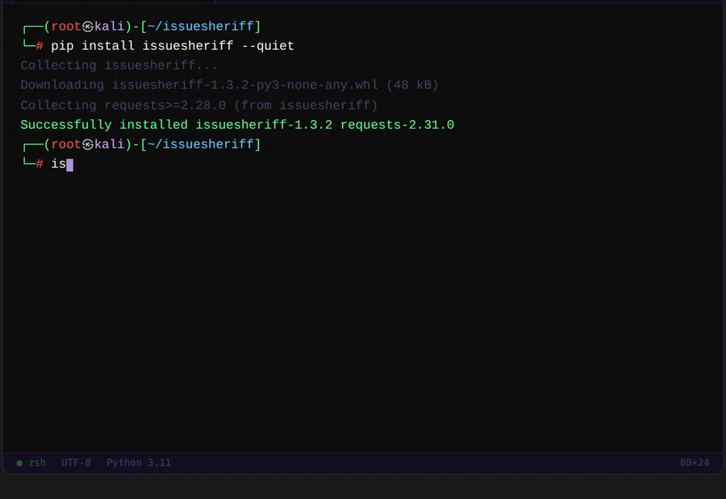

<div align="center">

```
██╗███████╗███████╗██╗   ██╗███████╗███████╗██╗  ██╗███████╗██████╗ ██╗███████╗███████╗
██║██╔════╝██╔════╝██║   ██║██╔════╝██╔════╝██║  ██║██╔════╝██╔══██╗██║██╔════╝██╔════╝
██║███████╗███████╗██║   ██║█████╗  ███████╗███████║█████╗  ██████╔╝██║█████╗  █████╗
██║╚════██║╚════██║██║   ██║██╔══╝  ╚════██║██╔══██║██╔══╝  ██╔══██╗██║██╔══╝  ██╔══╝
██║███████║███████║╚██████╔╝███████╗███████║██║  ██║███████╗██║  ██║██║██║     ██║
╚═╝╚══════╝╚══════╝ ╚═════╝ ╚══════╝╚══════╝╚═╝  ╚═╝╚══════╝╚═╝  ╚═╝╚═╝╚═╝     ╚═╝
```

### AI-powered GitHub issue triage — in your terminal, in seconds.

<br/>

[](https://pypi.org/project/issuesheriff/)
[](https://python.org)
[](LICENSE)
[](https://github.com/aaxnet/issuesheriff/actions)
[](https://pypi.org/project/issuesheriff/)

<br/>



<br/>

[](README.ru.md)
[](https://pypi.org/project/issuesheriff/)
[](https://github.com/aaxnet/issuesheriff/issues/new)
[](https://github.com/aaxnet/issuesheriff/issues/new)

</div>

---

## The problem

You open your repo after a weekend. **47 new issues.**

Duplicates. Vague bug reports. Feature requests disguised as bugs. Questions that belong in Discussions. You spend an hour just reading and labeling — before writing a single line of code.

**IssueSheriff fixes that.**

One command scans your entire issue tracker, classifies every issue, spots duplicates, suggests labels, and drafts ready-to-send maintainer replies — in the time it takes to make coffee.

---

## Install

```bash
pip install issuesheriff

# Recommended — includes duplicate detection
pip install "issuesheriff[similarity]"
```

> Works out of the box **without any API key.** AI features activate automatically when you configure them.

---

## Quickstart

###  Step 1 — Configure (once)

```bash
issuesheriff setup
```

An interactive wizard asks for your GitHub token and optionally an AI backend. Everything is saved to `~/.config/issuesheriff/.env` — no need to export env vars every time.

```
┌─────────────────────────────────────────────────┐
│  IssueSheriff Setup Wizard                      │
│  Press Enter to keep current value in brackets. │
└─────────────────────────────────────────────────┘

── Required ──────────────────────────────────────
  GitHub Token (repo + issues:write): ghp_***
── AI Backend (both optional) ───────────────────
  OpenAI API Key (blank to skip): sk-***
  Ollama model  (blank to skip):
── Tuning (optional) ─────────────────────────────
  Duplicate threshold (default 0.45):
  Max issues per scan (default 100):

✓ Saved: ~/.config/issuesheriff/.env
```

> **Where to get a GitHub token** → [github.com/settings/tokens](https://github.com/settings/tokens) → Generate new token (classic) → check `repo` + `write:issues`

###  Step 2 — Run

```bash
# Scan a repository
issuesheriff scan microsoft/vscode --limit 20

# Apply labels to a specific issue
issuesheriff labels microsoft/vscode 42 --apply

# Generate a maintainer reply (copy to clipboard)
issuesheriff reply microsoft/vscode 42 --copy

# Analyze an issue from a local JSON file
issuesheriff analyze issue.json
```

---

## What it does

| | Command | Description |
|:---:|---|---|
|  | `setup` | Interactive wizard — configure tokens and AI backend once |
|  | `scan <owner/repo>` | Fetch all open issues, classify them, detect duplicates, print summary |
|  | `analyze <file.json>` | Deep analysis of a single issue — type, labels, confidence, reply draft |
|  | `labels <owner/repo> <#>` | Suggest labels for one issue; `--apply` writes them to GitHub |
|  | `reply <owner/repo> <#>` | Generate a human-sounding maintainer reply; `--copy` puts it in clipboard |

---

## Output

```
┌──────────────────────────────────────────────────────────────┐
│  microsoft/vscode  —  20 issues loaded                       │
└──────────────────────────────────────────────────────────────┘

  #209  Extension host crashes on startup  [BUG]
  Summary: Extension host process dies on launch, blocking all extensions.
  Labels  bug  crash

  #208  Add vim keybindings to terminal  [FEATURE]
  Summary: User requests native Vim mode keybindings in the integrated terminal.
  Labels  feature  terminal

  #207  How do I change the default shell?  [DOCS]
  Summary: User unsure how to configure the default shell in VS Code settings.
  Labels  question  docs

── Duplicate Detection ────────────────────────────────────────

  #206  Terminal not opening  ──→  #201   ████░░ 81%
  #203  Shell crashes on open  ──→  #201  ███░░░ 57%
```

`issuesheriff analyze issue.json --json` returns structured JSON you can pipe anywhere:

```json
{
  "summary": "Application crashes on launch after the latest update.",
  "type": "bug",
  "labels": ["bug", "crash", "regression"],
  "confidence": 0.94,
  "similar_issues": [
    { "id": 209831, "score": 0.81 },
    { "id": 208104, "score": 0.57 }
  ],
  "reply": "Thanks for the report — this looks like a regression. We'll investigate and keep you posted."
}
```

---

## AI backends

###  OpenAI — best accuracy

```bash
issuesheriff setup   # enter your sk-... key when prompted
```

`gpt-4o-mini` by default — fast and cheap (~$0.001 per issue). Swap for `gpt-4o` for higher accuracy.

###  Ollama — fully offline

No data leaves your machine:

```bash
ollama pull mistral
issuesheriff setup   # enter "mistral" when asked for Ollama model
```

###  No AI — zero config

Heuristic classification + TF-IDF duplicate detection, no API needed:

```bash
issuesheriff scan aaxnet/issuesheriff --no-reply
```

---

##  Automate with GitHub Actions

```yaml
name: Auto Triage

on:
  issues:
    types: [opened, reopened]

permissions:
  issues: write
  contents: read

jobs:
  triage:
    runs-on: ubuntu-latest
    steps:
      - uses: actions/checkout@v4
      - run: pip install "issuesheriff[similarity]"
      - run: |
          echo '{"title":"${{ github.event.issue.title }}","body":"${{ github.event.issue.body }}"}' > issue.json
          issuesheriff analyze issue.json --json > result.json
        env:
          GITHUB_TOKEN:   ${{ secrets.GITHUB_TOKEN }}
          OPENAI_API_KEY: ${{ secrets.OPENAI_API_KEY }}
```

---

## Configuration

| Variable | Default | Description |
|---|---|---|
| `GITHUB_TOKEN` | — | GitHub token (`repo` + `issues:write`) |
| `OPENAI_API_KEY` | — | OpenAI key — enables AI classification and replies |
| `ISSUESHERIFF_MODEL` | `gpt-4o-mini` | OpenAI model |
| `OLLAMA_MODEL` | — | Local Ollama model (e.g. `mistral`) |
| `OLLAMA_BASE_URL` | `http://localhost:11434` | Ollama server address |
| `SIMILARITY_THRESHOLD` | `0.45` | Cosine similarity cutoff for duplicate detection |
| `MAX_ISSUES` | `100` | Max issues fetched per `scan` |

All variables can be set via `issuesheriff setup` or manually in `~/.config/issuesheriff/.env`.

---

## Install options

```bash
pip install issuesheriff                          # core only
pip install "issuesheriff[similarity]"            # + duplicate detection  ← recommended
pip install "issuesheriff[similarity,ollama]"     # + Ollama support
pip install "issuesheriff[similarity,ollama,dev]" # full dev setup
```

---

## Contributing

```bash
git clone https://github.com/aaxnet/issuesheriff
cd issuesheriff
pip install -e ".[dev,similarity]"
pytest && ruff check .
```

PRs welcome. See [open issues](https://github.com/aaxnet/issuesheriff/issues).

---

<div align="center">
<br/>

If IssueSheriff saved you time — a  helps other maintainers find it.

<br/>

[](https://github.com/aaxnet/issuesheriff)
[](https://pypi.org/project/issuesheriff/)
[](https://github.com/aaxnet/issuesheriff/issues/new)

<br/>
</div>
